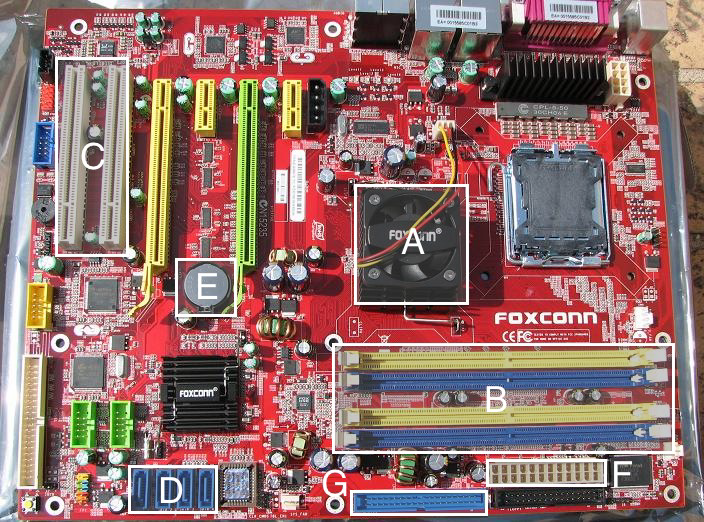

# PROBLEM SET 1

### Academic Honesty

All work that you do toward fulfillment of this course’s expectations must be your own unless collaboration
is explicitly allowed by the staff. Viewing, requesting, or copying another individual’s
work or lifting material from a book, magazine, website, or other source—even in part—and presenting
it as your own constitutes academic dishonesty, as does showing or giving your work, even
in part, to another student. 
Similarly is dual submission academic dishonesty: you may not submit the same or similar work
to this course that you have submitted or will submit to another. Nor may you provide or make
available solutions to homework or exams to individuals who take or may take this course in the
future. Moreover, submission of any work that you intend to use outside of the course (e.g., for a
job) must be approved by the staff. 
If in doubt as to the appropriateness of some act, contact the staff. All forms of academic dishonesty
are dealt with harshly.

### Mother, I'm bored.
1. (2 points each) Below is a motherboard with 7 unlabeled parts (lettered A–G, to be clear). For each of these letters, tell us:
    * What the component is called
    * What the component is used for (e.g., what devices plug into it)

    

2. (5 points) In a succinct but technically detailed paragraph, what happens when you turn on your
computer?

### Windows Explorer
3. (3 points) Time for some exploring! Let’s get to know your computer a little better. Tell us the
following about the computer you have at home or at work:
    * Brand and model
    * Hard drive capacity
    * Amount of RAM
    * Model and speed of CPU
    * Display resolution and size
    * Operating system

### Power Shopping
4. (3 points) I just purchased a new computer monitor with only a DVI port. Sadly, my laptop
only has a slot for an HDMI cable. Am I out of luck? Why or why not? My sister’s laptop, on the
other hand, has a slot for a VGA cable, should I just give the monitor to her? Why or why not?

5. (2 points) So, should you spend $250 on an HDMI cable? Why or why not?

### A Bit of Binary
8. (2 points each) Convert the following numbers from decimal to binary, showing each step.
    * 50
    * 164

9. (2 points each) Convert the following numbers from binary to decimal, showing each step.
    * 0101010
    * 010101111

10. (2 points) What do all binary numbers ending in 1 have in common?

11. (2 points) What’s the largest (positive) number we can represent with 16 bits? How about
32 bits? Give your answers as decimal numbers, and don’t worry about taking negative numbers
into account!

12. (5 points) We’ve seen that decimal uses ten different digits and binary uses two different digits.
The octal system instead uses eight different digits, but works in exactly the same way. What is the
decimal value of the octal number 0644? How about 0755?
